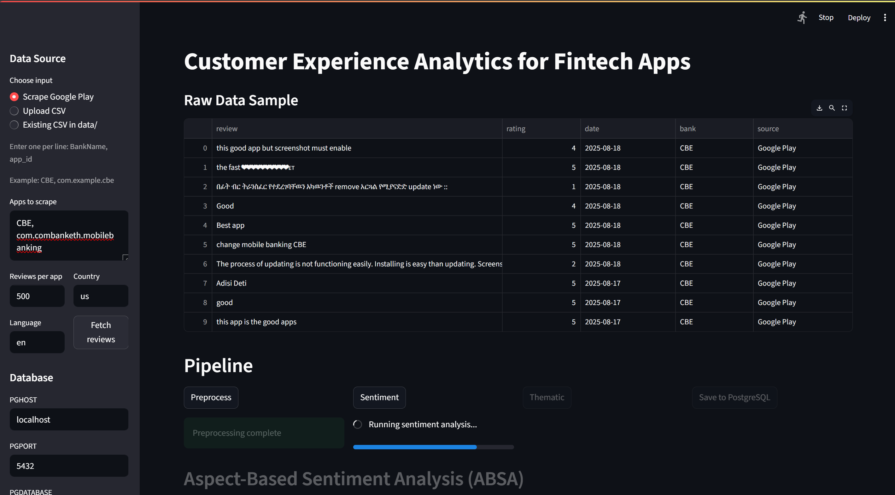

# Customer Experience Analytics for Fintech Apps

Analyze Google Play Store reviews for fintech banking apps to extract sentiment and themes, generate insights, and persist results to a PostgreSQL database. A Streamlit app is included to run the full pipeline end-to-end with optional Google Play scraping.

## Quick Preview


## Key Features
- Google Play scraping (in-app) for one or more banking apps
- Text preprocessing (cleaning, normalization)
- Sentiment analysis (Transformer-based)
- Thematic/topic tagging (keyword-based)
- Aspect-Based Sentiment Analysis (ABSA) tied to features like login, speed, reliability
- Insight generation and basic visualizations
- Persistence to PostgreSQL (banks and reviews tables)
- Jupyter notebooks for exploration and reporting
- Pytest suite with unit and opt-in integration tests

## Project Structure
```
fintech-app-analytics-week2/
├─ app/
│  └─ streamlit_app.py          # Streamlit UI for scrape → preprocess → sentiment → themes → ABSA → save
├─ data/
│  ├─ all_bank_reviews.csv
│  ├─ bank_reviews_with_sentiment.csv
│  ├─ BOA_reviews.csv
│  ├─ CBE_reviews.csv
│  ├─ Dashen_reviews.csv
│  └─ thematic_results.csv      # final processed dataset (script-based path)
├─ notebooks/
│  ├─ scraping_and_preprocessing.ipynb
│  ├─ sentiment_and_thematic_analysis.ipynb
│  ├─ insight_and_recommendation.ipynb
│  └─ save_to_database.ipynb
├─ scripts/
│  ├─ database.py               # save_to_postgres()
│  └─ README.md
├─ src/
│  ├─ Preprocessing/
│  │  ├─ play_store_scraper.py
│  │  └─ preprocessor.py
│  ├─ ThematicSentiment/
│  │  ├─ SentimentAnalysis.py
│  │  └─ ThematicAnalysis.py
│  └─ Insight/
│     ├─ Analysis/analyzer.py
│     └─ Visualization/visualizer.py
├─ tests/
│  ├─ test_preprocessor.py
│  ├─ test_play_store_scraper.py
│  ├─ test_thematic_analysis.py
│  ├─ test_analyzer.py
│  └─ test_database_integration.py
├─ requirements.txt
└─ README.md
```

## Data Pipeline (High Level)
1. Scrape reviews per bank from Google Play (via Streamlit or `src/Preprocessing/play_store_scraper.py`).
2. Clean and normalize text (`src/Preprocessing/preprocessor.py` logic mirrored in app).
3. Run sentiment analysis (Transformers) to label and score reviews.
4. Run thematic tagging (keyword-based) to group reviews by theme.
5. Optionally run ABSA to tie sentiment to specific aspects (login, speed, etc.).
6. Persist to PostgreSQL using `scripts/database.py` or from the Streamlit app.
7. Explore insights and visuals in notebooks or the Streamlit UI.

## Requirements
- Python 3.10+ recommended
- PostgreSQL 13+ (local or remote)
- Packages listed in `requirements.txt` (key: pandas, transformers, torch, scikit-learn, spacy, seaborn, matplotlib, wordcloud, psycopg2-binary, streamlit, ipykernel, pytest)

Optional (spaCy model):
```
python -m spacy download en_core_web_sm
```
The app and tests can fall back to lightweight processing if the model is unavailable.

## Setup (Windows PowerShell)
1. Create and activate a virtual environment
```
python -m venv .venv
.\.venv\Scripts\Activate.ps1
```
2. Install dependencies
```
pip install --upgrade pip
pip install -r requirements.txt
```

## Configure PostgreSQL
1. Ensure a PostgreSQL server is running and that you have a database (default used below is `fintech`).
2. Set environment variables before running scripts or set them via the Streamlit sidebar:
```
$env:PGHOST = "localhost"
$env:PGPORT = "5432"
$env:PGDATABASE = "fintech"
$env:PGUSER = "postgres"
$env:PGPASSWORD = "postgres"
```

## Streamlit App (End-to-End)
Launch the app:
```
streamlit run app/streamlit_app.py
```
In the sidebar:
- Choose a data source:
  - Scrape Google Play: enter lines like `CBE, com.example.cbe`, pick language/country and review count, then Fetch reviews.
  - Upload CSV: provide one or more CSVs.
  - Existing CSV in data/: auto-loads `./data/*.csv`.
- Optionally set PG env vars (Apply DB Env).

Pipeline buttons:
1) Preprocess → 2) Sentiment → 3) Thematic → 4) Save to PostgreSQL
- ABSA: Run ABSA to compute aspect-level sentiments; view counts and average scores.
- Download: Export the processed dataset as CSV.

## Script Usage (CLI)
Programmatic insert to PostgreSQL from the final CSV (`data/thematic_results.csv`):
```
python -c "from scripts.database import save_to_postgres; save_to_postgres()"
```
This will:
- Create tables if they do not exist
- Insert unique banks into `banks`
- Insert reviews and associated metadata into `reviews`

### Database Schema
- banks
  - bank_id INTEGER PRIMARY KEY
  - bank_name VARCHAR(100)
- reviews
  - review_id VARCHAR(50) PRIMARY KEY
  - review_text TEXT
  - rating INTEGER
  - review_date DATE
  - sentiment_label VARCHAR(20)
  - sentiment_score DOUBLE PRECISION
  - themes VARCHAR(100)
  - bank_id INTEGER REFERENCES banks(bank_id)

Note: The script drops and recreates tables by default for a clean load. Remove the `DROP` statements if you need to append data.

## Testing
Run unit tests only:
```
pytest -m "not integration"
```
Run all tests (requires a running PostgreSQL and env vars):
```
pytest
```
Notes:
- Thematic analysis tests mock spaCy model loading to avoid large downloads.
- The integration test will skip automatically if the DB is unreachable.

## Troubleshooting
- Transformers model download: requires internet on first run; cached afterward.
- spaCy model: install `en_core_web_sm` for better lemmatization; app/notebooks may fallback to basic processing otherwise.
- Google Play scraping: network/rate limits may apply; reduce `Reviews per app` or try later.
- PostgreSQL connectivity: verify env vars and that the database is reachable.
- Large datasets: consider batched inserts or COPY for performance.

## License
MIT License